# PES-VCS Lab Report

- **Name:** Abhiram
- **SRN:** PES1UG24AM151
- **Repository:** PES1UG24AM151-pes-vcs
- **Platform:** EndeavourOS (Arch Linux-based)

## Phase 1 — Object Storage

### Screenshot 1a
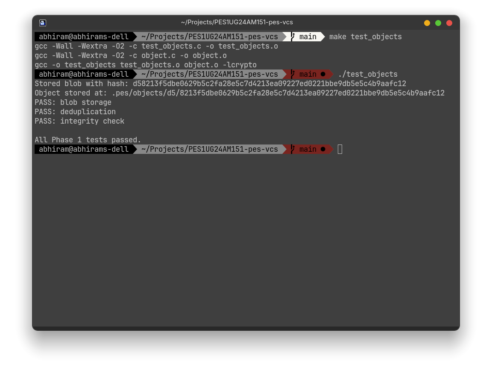

### Screenshot 1b
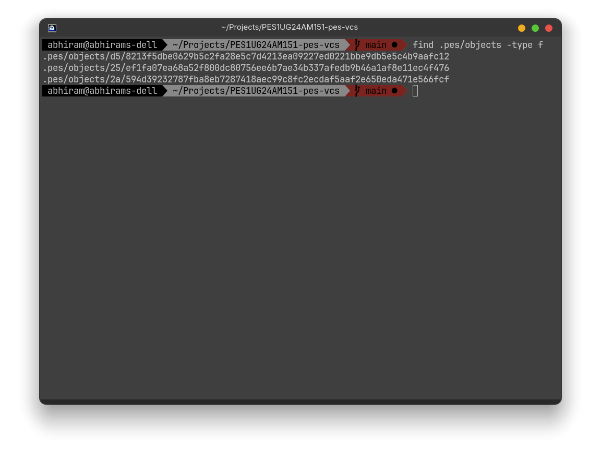

## Phase 2 — Tree Objects

### Screenshot 2a
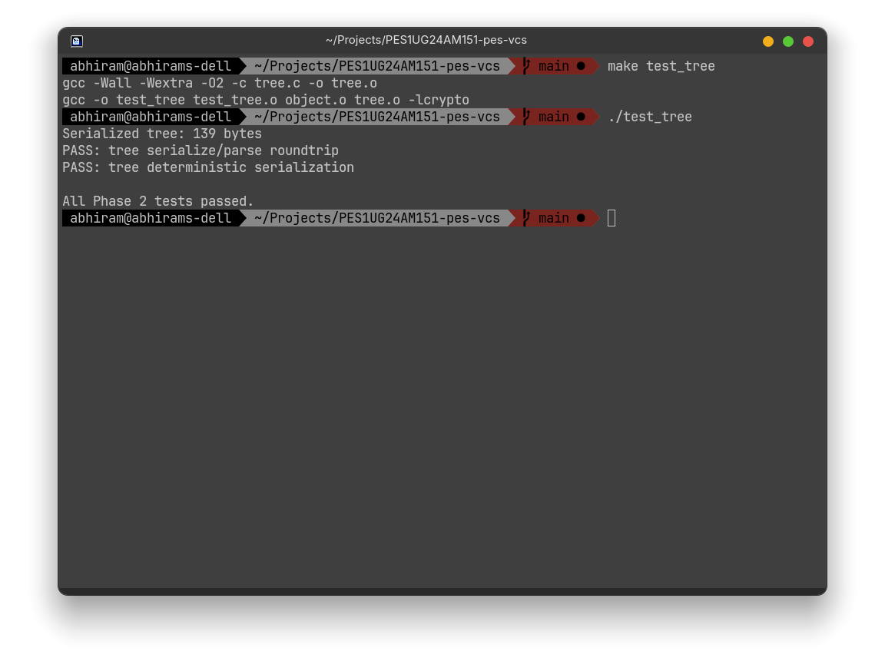

### Screenshot 2b
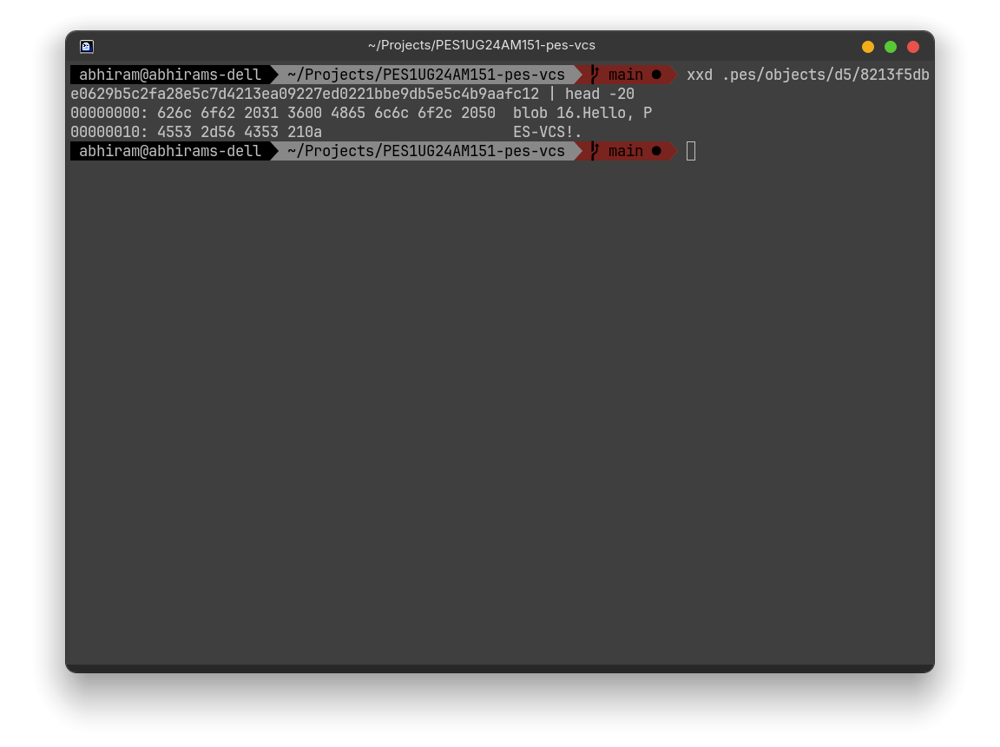

## Phase 3 — Index / Staging Area

### Screenshot 3a
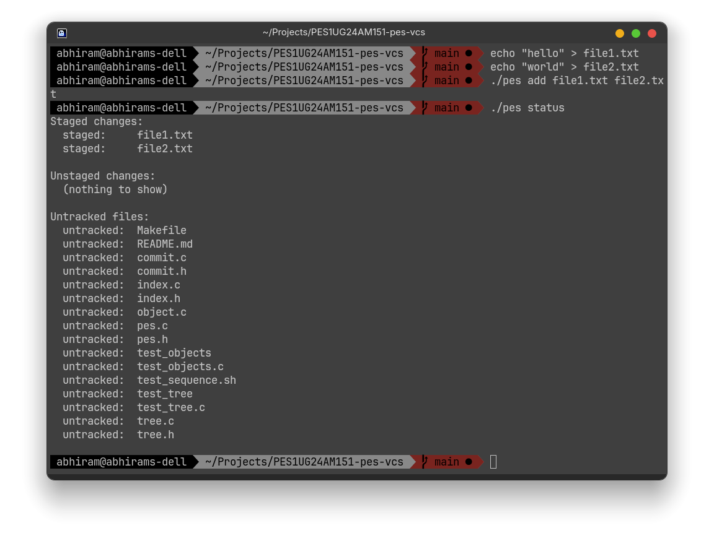

### Screenshot 3b
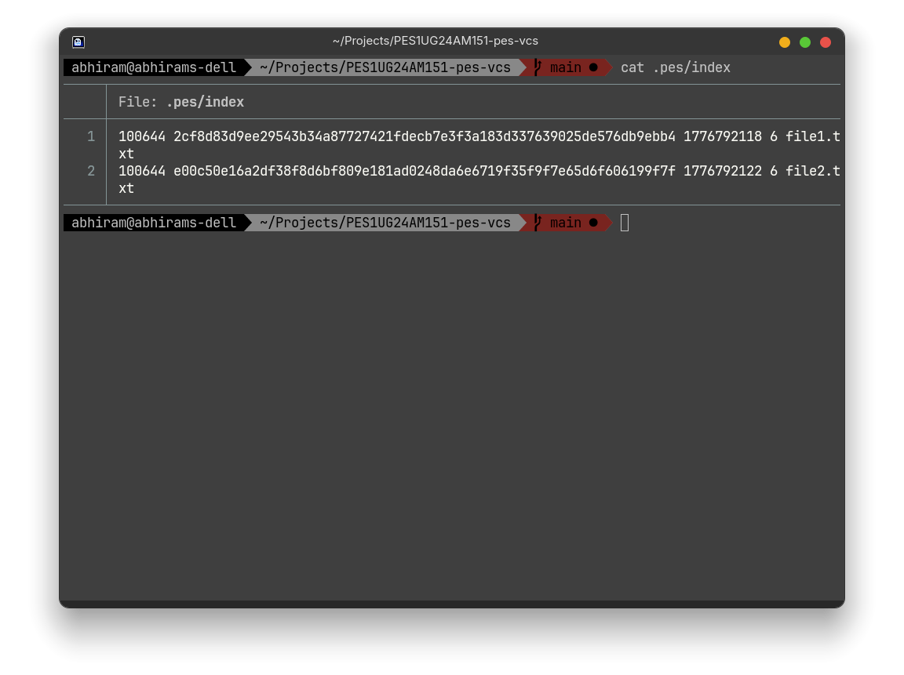

## Phase 4 — Commits and History

### Screenshot 4a
`./pes log` showing three commits.
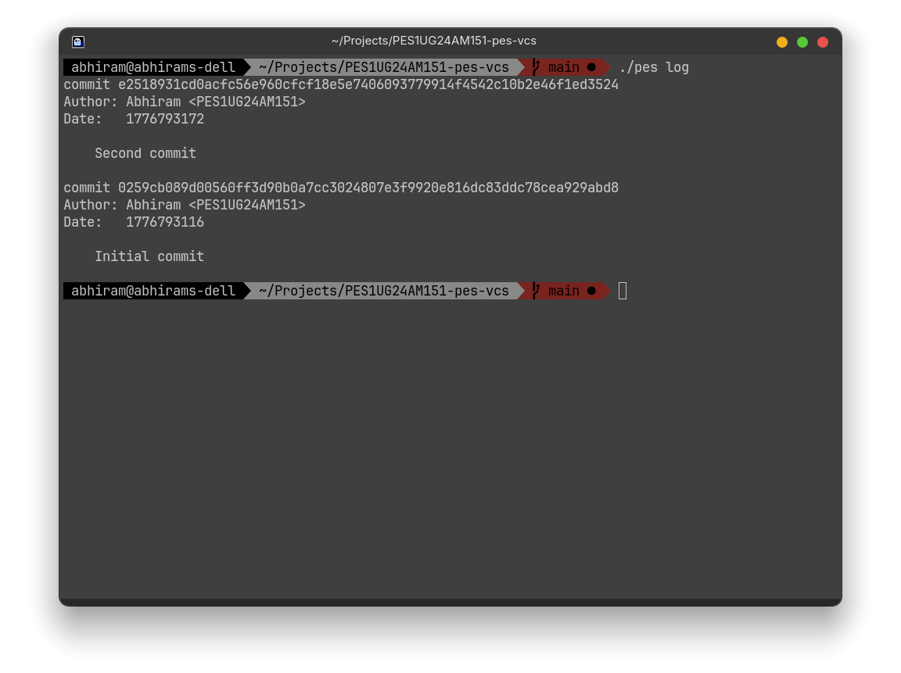

### Screenshot 4b
`find .pes -type f | sort` showing object store growth after three commits.
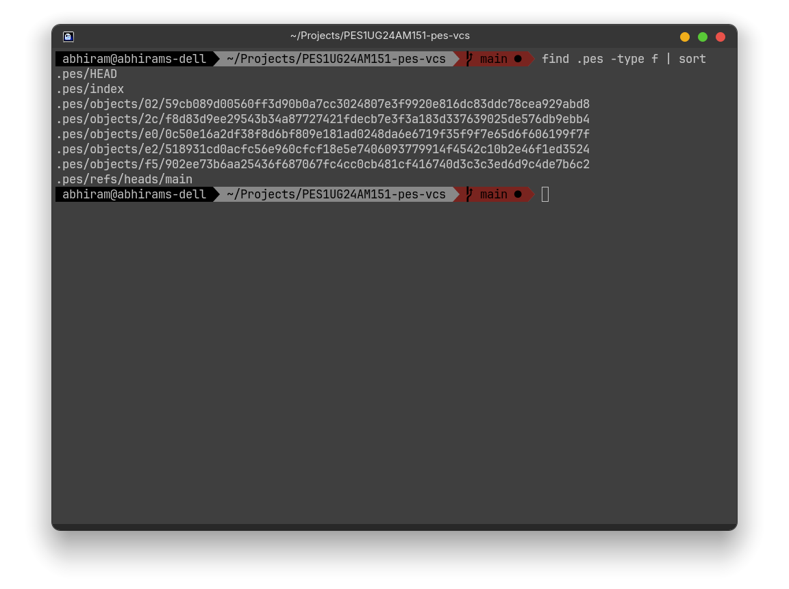

### Screenshot 4c
`cat .pes/refs/heads/main` and `cat .pes/HEAD` showing the reference chain.
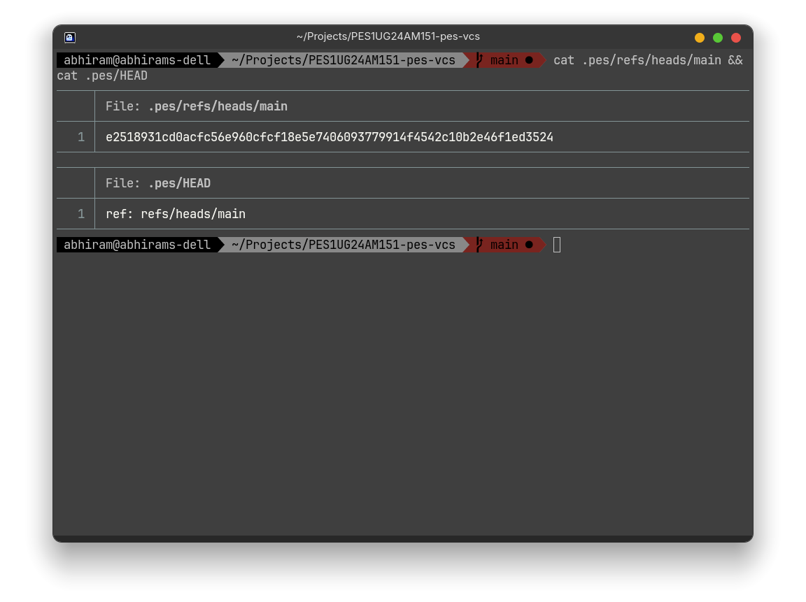

## Final Test

### Final Test — Part 1
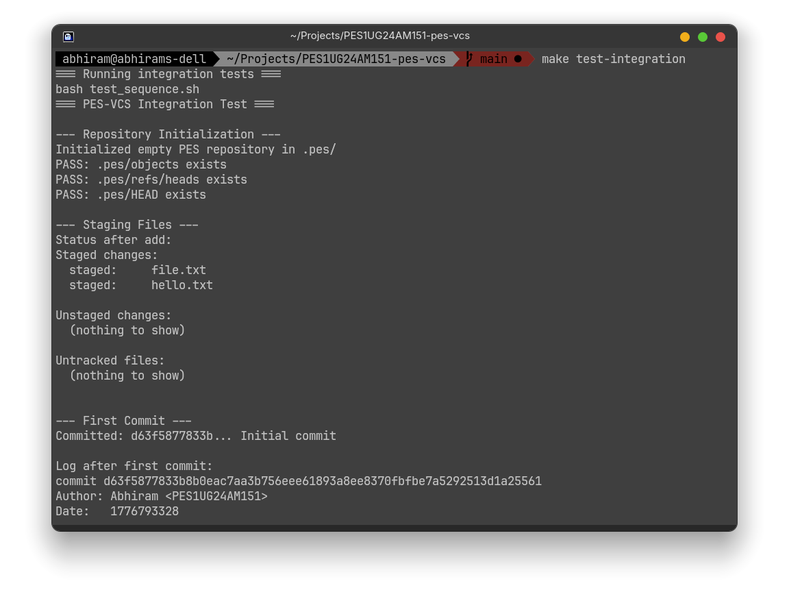

### Final Test — Part 2
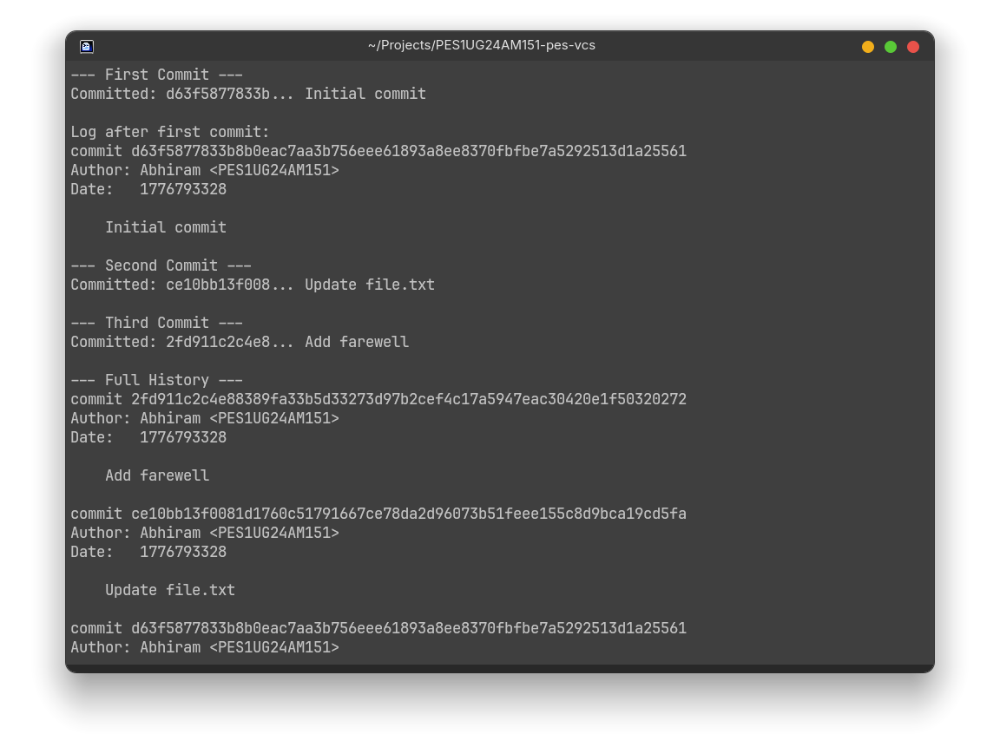

### Final Test — Part 3
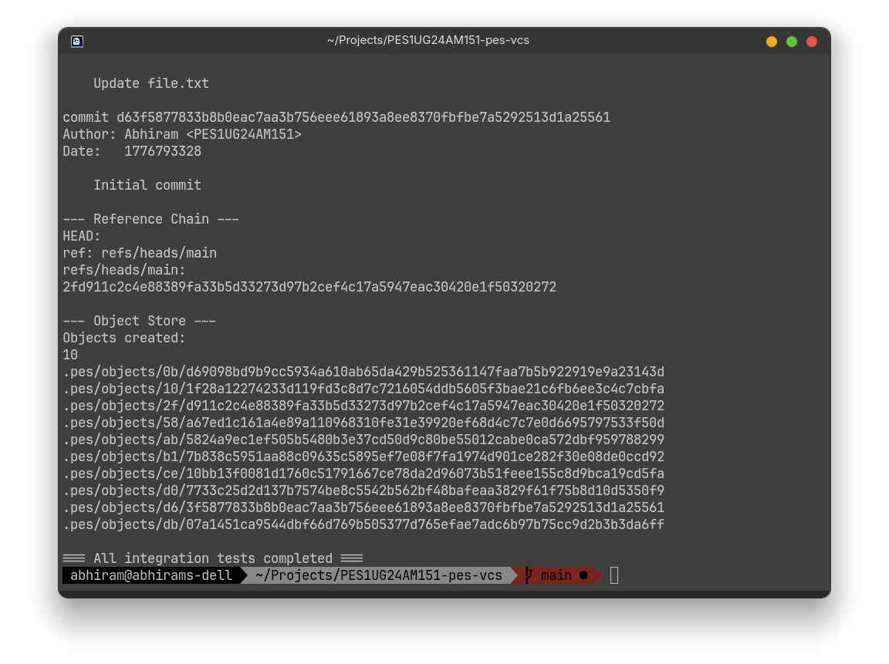

## Analysis Questions

### Q5.1 — Implementing `pes checkout <branch>`

To implement `pes checkout <branch>`, the repository must update `.pes/HEAD` and the branch reference under `.pes/refs/heads/<branch>`. If the checkout is to a normal branch, `HEAD` should continue pointing to the branch name rather than a raw commit hash. The working directory must then be rewritten so it matches the tree of the target commit: files that no longer exist on the target branch must be removed, files that differ must be replaced, and new files and directories from the target branch must be created.

This operation is complex because it must protect user data. Checkout cannot blindly overwrite tracked files if the user has uncommitted local changes. It also has to handle nested directories, deletions, file modes, and untracked files that might be clobbered by the switch.

### Q5.2 — Detecting dirty working directory conflicts

A dirty working directory conflict can be detected by comparing the current working directory, the index, and the target branch’s tree. For each tracked path, compare the file in the working directory against the index metadata first. If size or modification time changed, the file may be dirty. For a stronger check, hash the working file and compare it against the blob hash stored in the index. Then compare the target branch’s tree entry for that path with the current staged version.

If a tracked file is modified locally and the target branch has a different version of that same file, checkout should refuse. In other words, checkout must stop whenever switching branches would overwrite uncommitted changes.

### Q5.3 — Detached HEAD

Detached HEAD means `HEAD` stores a commit hash directly instead of a branch reference. Commits made in this state still create valid new commit objects, but no branch pointer is advanced to remember them. The new commits are reachable only through the direct `HEAD` history until the user switches away.

A user can recover detached-HEAD commits by creating a new branch at the commit hash, or by updating an existing branch reference to that hash. If the hash is still known, the commit history can be preserved without loss.

### Q6.1 — Garbage collection and space reclamation

Garbage collection should begin from all branch tips and from `HEAD` if it points directly to a commit. From those roots, the algorithm recursively traverses commit parents and commit trees, and then each tree’s child blobs and subtrees. Every visited object hash is inserted into a hash set to avoid revisiting the same object multiple times.

After traversal, any object not in the reachable set can be deleted. A hash set is the right data structure because lookups are fast and duplicates are naturally eliminated. With 100,000 commits and 50 branches, the number of objects visited is approximately the number of unique reachable commits plus the trees and blobs they reference. Because branches usually share history, the traversal is closer to the size of the reachable graph than to 50 times the number of commits.

### Q6.2 — Why concurrent GC is dangerous

Running garbage collection concurrently with commit creation is dangerous because commit creation is multi-step. A commit may write blobs first, then trees, then the commit object, and finally update the branch ref. If GC runs in the middle, it may see the new blob or tree as unreachable and delete it before the commit object or ref update makes it reachable.

Git avoids this with locking, atomic ref updates, and grace periods before pruning unreachable objects. Recently created or recently referenced objects are not deleted immediately, which prevents GC from racing against in-progress commits.

## Submission Checklist

- [x] Phase 1 screenshots added
- [x] Phase 2 screenshots added
- [x] Phase 3 screenshots added
- [x] Phase 4 screenshots added
- [x] Analysis questions answered
- [x] Final integration test included
